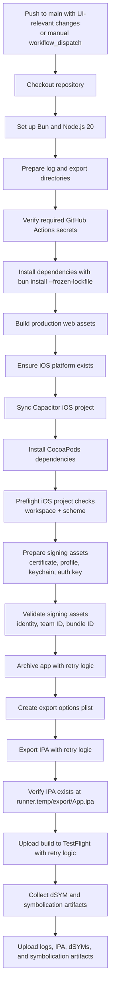

# SphereX

SphereX is a privacy-first social app built around mutual intent: add someone by phone number, and only when they add you back do you unlock the connection.

- **Live app:** [spherex.lovable.app](https://spherex.lovable.app)
- **Platform:** Web + Capacitor iOS shell
- **Status:** Active Lovable project with GitHub sync and TestFlight automation

## What the app does

SphereX focuses on lightweight, private interactions:

- add people by phone number
- reveal connections only when interest is mutual
- support onboarding, invites, and match flows
- use phone-based authentication
- support native iOS capabilities like contacts and haptics

## Tech stack

| Layer | Stack |
|---|---|
| App framework | TanStack Start + React 19 |
| Build tooling | Vite 7 |
| Routing | TanStack Router |
| Styling | Tailwind CSS v4 + shadcn/ui |
| Data/auth/backend | Lovable Cloud |
| Native shell | Capacitor 8 for iOS |
| Language | TypeScript + JSX |

## Key project areas

```text
src/
├── routes/                  # App routes and page entry points
├── mutual/                  # Core product flows, screens, data logic, native helpers
├── components/ui/           # Shared UI primitives
├── integrations/            # Backend and server-side integrations
├── hooks/                   # Shared React hooks
└── styles.css               # Global design tokens and styling

public/                      # Static assets, favicon, manifest
scripts/                     # Validation and workflow helper scripts
supabase/                    # Backend config and migrations
.github/workflows/           # CI/TestFlight automation
```

### Current route files

The active route files in `src/routes/` are:

`__root.tsx`, `_app.tsx`, `_app.add.tsx`, `_app.admin.tsx`, `_app.code.tsx`, `_app.contacts.tsx`, `_app.home.tsx`, `_app.match.tsx`, `_app.onboarding-import.tsx`, `_app.phone.tsx`, `_app.profile.tsx`, `_app.sent.tsx`, `_app.sitemap.tsx`, `_app.thread.$hash.tsx`, `_app.welcome.tsx`, `i.$hash.tsx`, `index.tsx`, `privacy.tsx`, and `terms.tsx`.

## Local development

### Prerequisites

- **Bun:** latest (the CI workflow installs Bun via `oven-sh/setup-bun@v2` with `bun-version: latest`)
- **Node.js:** 20.x (the CI workflow uses `actions/setup-node@v4` with `node-version: 20`)
- **iOS toolchain for native builds:** Xcode on macOS with CocoaPods available (`pod install` is run in CI on `macos-15`)
- **Backend access:** Lovable Cloud connected for backend-backed flows

### Required local commands

For web development:

```bash
bun install
bun run dev
```

For production build verification:

```bash
bun run build
```

For local iOS preparation:

```bash
bun run build
bunx cap sync ios
bunx cap open ios
```

If the `ios` directory has not been added yet, the CI workflow indicates the required bootstrap command is:

```bash
bunx cap add ios
```

If you need to mirror the native dependency step used in CI, run:

```bash
pod install --project-directory=ios/App
```

### Install

```bash
bun install
```

### Run the app

```bash
bun run dev
```

### Useful scripts

```bash
bun run dev         # Start local dev server
bun run build       # Run phone-flow check, then production build
bun run build:dev   # Development-mode build
bun run preview     # Preview the production build locally
bun run lint        # Lint the codebase
bun run format      # Format files with Prettier
bun run check:phone-flow  # Validate the phone auth delivery flow script
```

## Backend and secrets

This project uses Lovable Cloud for backend services, authentication, and data storage.

Runtime environment values are managed by the platform. Sensitive values such as phone hashing secrets and provider credentials should be stored as project secrets rather than committed to the repo.

### Environment variables used by this project

The codebase currently references these variables:

| Variable | Source | Where it is used |
|---|---|---|
| `VITE_SUPABASE_URL` | Platform-provided client env | Browser/client initialization for the backend client |
| `VITE_SUPABASE_PUBLISHABLE_KEY` | Platform-provided client env | Browser/client initialization for the backend client |
| `SUPABASE_URL` | Platform/runtime secret | Server-side backend client and auth middleware |
| `SUPABASE_PUBLISHABLE_KEY` | Platform/runtime secret | SSR/auth middleware fallback |
| `SUPABASE_SERVICE_ROLE_KEY` | Platform/runtime secret | Server-side admin access |
| `PHONE_PEPPER` | Project runtime secret | Server-side phone hashing |
| `TWILIO_API_KEY` | Project runtime secret / connector credential | SMS verification requests |
| `LOVABLE_API_KEY` | Platform-managed runtime secret | Authenticated requests to the Twilio gateway |

The repository also defines these GitHub Actions workflow variables for iOS builds:

| Variable | Source | Where it is used |
|---|---|---|
| `BUNDLE_ID` | Repo workflow file | iOS archive/export bundle identifier |
| `LOG_DIR` | Repo workflow file | Build logs and debug artifacts |
| `APPLE_TEAM_ID` | GitHub Actions secret | Signing and provisioning validation |
| `CERTIFICATE_PASSWORD` | GitHub Actions secret | Importing the iOS distribution certificate |
| `CERTIFICATE_BASE64` | GitHub Actions secret | Decoded `.p12` signing certificate |
| `PROFILE_BASE64` | GitHub Actions secret | Decoded App Store provisioning profile |
| `APP_STORE_CONNECT_ISSUER_ID` | GitHub Actions secret | App Store Connect authentication |
| `APP_STORE_CONNECT_KEY_ID` | GitHub Actions secret | App Store Connect authentication |
| `APP_STORE_CONNECT_PRIVATE_KEY` | GitHub Actions secret | App Store Connect API key file |

In short: app runtime values come from Lovable Cloud and project secrets, while iOS release-signing values come from the GitHub Actions workflow and its repository secrets.

### Required GitHub secrets for the iOS workflow

The TestFlight workflow requires these GitHub repository secrets:

| Secret name | Used for |
|---|---|
| `APPLE_TEAM_ID` | Sets the Apple Developer team for signing, archive validation, and export configuration. |
| `IOS_DISTRIBUTION_CERTIFICATE_PASSWORD` | Unlocks the `.p12` iOS distribution certificate during import into the temporary build keychain. |
| `IOS_DISTRIBUTION_CERTIFICATE_BASE64` | Stores the base64-encoded distribution signing certificate that the workflow decodes before archiving. |
| `IOS_APPSTORE_PROFILE_BASE64` | Stores the base64-encoded App Store provisioning profile used for manual signing and bundle ID validation. |
| `APP_STORE_CONNECT_ISSUER_ID` | Identifies the App Store Connect API issuer for archive/export authentication and TestFlight upload. |
| `APP_STORE_CONNECT_KEY_ID` | Identifies the App Store Connect API key paired with the private key file. |
| `APP_STORE_CONNECT_PRIVATE_KEY` | Provides the App Store Connect private key contents used to authenticate archive/export operations and the TestFlight upload. |

If any of these secrets are missing, the workflow fails in its early validation step before the Xcode build begins.

## iOS workflow

The project is configured for Capacitor iOS builds and TestFlight delivery.

Typical local iOS flow:

```bash
bun run build
bunx cap sync ios
bunx cap open ios
```

The GitHub Actions workflow handles automated TestFlight packaging and now includes:

- frontend-focused path filters
- iOS workspace and scheme preflight checks
- signing asset validation before `xcodebuild`
- retry logic for archive, export, and upload steps
- IPA existence verification at `runner.temp/export/App.ipa`
- uploaded debug artifacts including logs, dSYMs, and symbolication details

### iOS GitHub Actions workflow, step by step

The iOS workflow is designed to run when the app UI changes in ways that affect the shipped mobile build.



#### 1. What triggers the workflow

The workflow starts in two cases:

- **Push to `main`** when UI-relevant files change, such as routes, shared components, hooks, styles, public assets, Capacitor config, Vite config, and related frontend build files
- **Manual run** through `workflow_dispatch`

This keeps TestFlight builds focused on changes that can actually affect the app users install.

#### 2. Environment and dependency setup

Once triggered, GitHub Actions prepares the macOS build runner by:

1. checking out the repository
2. installing Bun and Node.js
3. creating temporary directories for logs and exported build outputs
4. verifying that required Apple signing and App Store Connect secrets are present
5. installing web dependencies with `bun install --frozen-lockfile`

#### 3. Web app build

Before the native iOS archive is created, the workflow builds the frontend:

1. runs the production web build
2. ensures the iOS Capacitor platform exists
3. syncs the latest web assets into the iOS project
4. installs CocoaPods dependencies for the native workspace

This guarantees the native archive includes the latest shipped web code.

#### 4. iOS preflight validation

The workflow fails early if the native project is not ready. It checks for:

- the required Xcode workspace at `ios/App/App.xcworkspace`
- the expected Xcode scheme name

If either is missing, it stops before expensive build steps begin and saves the Xcode inspection output in the workflow logs.

#### 5. Signing asset preparation

The workflow then prepares release signing materials by:

1. decoding the distribution certificate and provisioning profile from GitHub secrets
2. writing the App Store Connect authentication key to a temporary file
3. creating and unlocking a temporary keychain
4. importing the signing certificate into that keychain
5. installing the provisioning profile into the macOS runner
6. extracting profile metadata such as the profile name for later archive/export steps

#### 6. Signing validation before build

Before `xcodebuild` runs, the workflow validates that signing is usable:

- confirms at least one valid code-signing identity was imported
- inspects the provisioning profile
- checks that the profile team ID matches the configured Apple team
- checks that the profile’s application identifier matches the bundle identifier, including valid wildcard cases

This catches common signing mistakes early, with clear logs instead of a later archive failure.

#### 7. Archive step with retries

The workflow archives the app with `xcodebuild archive` using manual signing settings.

- it archives the app into a temporary `.xcarchive`
- if the archive fails due to a transient issue, it retries up to 3 times
- each retry uses a short incremental delay
- logs from every attempt are appended to `archive.log`

#### 8. Export IPA with retries

After a successful archive, the workflow exports the installable IPA:

1. creates an export options plist for App Store distribution
2. runs `xcodebuild -exportArchive`
3. retries export up to 3 times if needed
4. saves export diagnostics to `export.log`

#### 9. TestFlight upload

Once the IPA is available, the workflow uploads it to TestFlight using App Store Connect credentials.

- it checks that `runner.temp/export/App.ipa` exists before upload starts
- it retries the upload up to 3 times for transient App Store Connect failures
- upload activity is captured in `testflight-upload.log`

#### 10. dSYM and symbolication artifacts

To improve crash debugging after TestFlight releases, the workflow also collects symbol files from the archive:

1. copies generated `.dSYM` bundles out of the `.xcarchive`
2. zips them for easy download
3. records UUIDs and related symbolication information in a dedicated log

These files make it much easier to match production crash reports to the exact build symbols.

#### 11. Uploaded artifacts

At the end of the run, the workflow uploads a debug artifact bundle containing the most useful investigation files, including:

- iOS build logs
- exported IPA
- zipped dSYMs
- symbolication logs

That means even failed or flaky runs leave behind enough information to diagnose signing issues, export problems, upload failures, and TestFlight crash symbolication needs.

### Troubleshooting checklist for common iOS workflow failures

Use this checklist when the TestFlight workflow fails:

#### Signing identity mismatch

- confirm `IOS_DISTRIBUTION_CERTIFICATE_BASE64` contains the correct App Store distribution certificate
- confirm `IOS_DISTRIBUTION_CERTIFICATE_PASSWORD` matches that `.p12` file
- check `signing-identities.log` to verify at least one valid code-signing identity was imported
- make sure the certificate belongs to the same Apple team as `APPLE_TEAM_ID`

#### Provisioning profile errors

- confirm `IOS_APPSTORE_PROFILE_BASE64` is an App Store provisioning profile, not a development profile
- verify the provisioning profile belongs to the same team as `APPLE_TEAM_ID`
- verify the profile’s application identifier matches the workflow bundle ID: `app.lovable.sphere`
- if using a wildcard profile, make sure it still covers the configured bundle identifier
- review `signing-validation.log` for the exact team ID and application identifier seen by the workflow

#### Workspace or scheme failures

- confirm `ios/App/App.xcworkspace` exists after `bunx cap sync ios`
- verify CocoaPods installed successfully with `pod install --project-directory=ios/App`
- make sure the expected Xcode scheme is `App`
- check `xcode-project-list.log` if the preflight step reports a missing workspace or scheme

#### Archive failures

- review `archive.log` first, since it contains output from all retry attempts
- confirm the signing certificate, provisioning profile, and team ID all refer to the same Apple account setup
- confirm the iOS project was synced after the latest web build
- open the native project in Xcode locally if you need to reproduce a code signing or capability error interactively

#### Export failures

- review `export.log` for export-specific signing or packaging errors
- verify the archive completed successfully before debugging export settings
- confirm the provisioning profile name extracted by the workflow still matches the installed profile
- check that the export method is valid for App Store distribution

#### IPA not found

- verify the export step completed successfully
- check the contents of the temporary export directory in the workflow logs
- confirm the workflow still expects the IPA at `runner.temp/export/App.ipa`

#### TestFlight upload issues

- review `testflight-upload.log` for authentication or App Store Connect errors
- verify `APP_STORE_CONNECT_ISSUER_ID`, `APP_STORE_CONNECT_KEY_ID`, and `APP_STORE_CONNECT_PRIVATE_KEY` belong to the same App Store Connect API key
- confirm the API key has permission to upload builds for the app
- retry may resolve transient App Store Connect failures, so check whether the final failure happened after all upload attempts

#### Missing debug artifacts

- confirm the archive step produced a `.xcarchive`
- check whether the archive contains a `dSYMs` directory before expecting `dSYMs.zip`
- review `symbolication.log` to see whether symbol bundles were found and processed

## GitHub sync

This repository is connected to Lovable with bidirectional sync:

- changes made in Lovable sync to GitHub
- changes pushed to GitHub sync back into Lovable

That makes GitHub the right place for collaboration, PR review, Actions, and release workflow history.

## Notes for contributors

- keep route changes inside `src/routes/`
- keep reusable UI in `src/components/` or `src/components/ui/`
- avoid editing generated backend client files
- prefer small, focused changes because this project syncs continuously between Lovable and GitHub

## License

Private / proprietary. All rights reserved.
